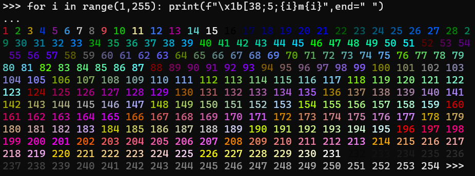

# Les Couleurs

Voici un tableau récapitulatif de la plupart des couleurs (merci à [fnky](https://gist.github.com/fnky/458719343aabd01cfb17a3a4f7296797)) :

| Nom de la Couleur | Code couleur des lettres | Code couleur de l'arrière plan |
| :---------------- | :----------------------- | :----------------------------- |
| Noir              | `30`                     | `40`                           |
| Rouge             | `31`                     | `41`                           |
| Vert              | `32`                     | `42`                           |
| Jaune             | `33`                     | `43`                           |
| Bleu              | `34`                     | `44`                           |
| Magenta ; Violet  | `35`                     | `45`                           |
| Cyan              | `36`                     | `46`                           |
| Blanc             | `37`                     | `47`                           |
| Défaut            | `39`                     | `49`                           |
| Reset             | `0`                      | `0`                            |
| Noir Brillant     | `90`                     | `100`                          |
| Rouge Brillant    | `91`                     | `101`                          |
| Vert Brillant     | `92`                     | `102`                          |
| Jaune Brillant    | `93`                     | `103`                          |
| Bleu Brillant     | `94`                     | `104`                          |
| Magenta ; Violet Brillant | `95`             | `105`                          |
| Cyan Brillant     | `96`                     | `106`                          |
| Blanc Brillant    | `97`                     | `107`                          |

Maintenant, avoir un tableau c'est bien, le comprendre c'est mieux !

>Syntaxe

Lorsque vous voulez dire à votre code python que vous utilisez une séquence d'échappement, vous devez obligatoirement écrire :

```
print("\x1b[")
```

***Le \x1b correspond au caracthère ESC de la table ASCII***

Ensuite, vous allez définir : ```{Couleur des lettres};{Couleur de l'arrière-plan}m```. Le *m* de la fin est très important car c'est lui qui va indiquer qu'il s'agit de la couleur... Par exemple, si on écrit un f, ce sera pour les séquences de position...

Ainsi, si nous voulons mettre **le texte en bleu** :

``
print("\x1b[34;49m")
``

**ATTENTION : il ne faut pas mettre la valeur 0 à l'arrière plan.**

Si vous le faite, cela va reset tout (même la couleur de police)

>Le 48

Effectivement, si vous avez regardé le tableau vous avez peut être remarqué que le 38 et le 48 n'y sont pas présent...

La raison ? Ils appellent un troisième argument de couleur...

**Texte**

``
print("\x1b[38;5;{ID}")
``

**Arrière Plan**

``
print("\x1b[48;5;{ID}")
``

Et vous pourrez choisir l'id jusqu'à 255 :


[Suite](c2.md)
[Menu](readme.md)
